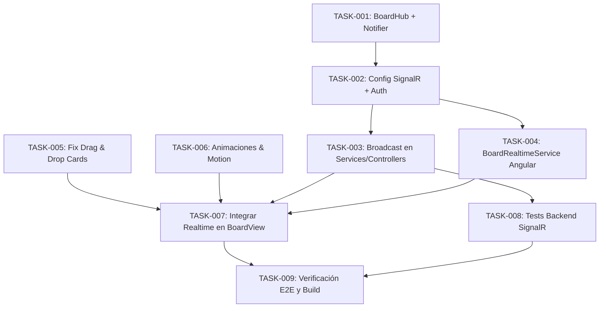

# Feature Plan: Actualizaciones en Tiempo Real, Arreglo de Drag & Drop y Animaciones Frontend

**Fecha**: 2026-09-03  
**Estado**: Completada  
**Prioridad**: Alta  

---

## Descripcion

Esta feature resuelve tres necesidades críticas solicitadas por el usuario para la experiencia de Trello:
1. **Actualizaciones en Tiempo Real**: Sincronización instantánea de tableros entre usuarios o pestañas sin necesidad de recargar la página (F5), implementada con ASP.NET Core SignalR en el backend y `@microsoft/signalr` en Angular.
2. **Corrección de Drag & Drop de Tarjetas**: Arreglo del problema por el cual las tarjetas se podían arrastrar pero no cambian de lista. Se desacopla el anidamiento conflictivo de `cdkDropListGroup` en `lists-container`, se conecta explícitamente mediante `cdkDropListConnectedTo`, se corrige la superficie de drop en listas vacías/cortas y se asegura la reactividad con Angular Signals.
3. **Movimiento y Animaciones en el Frontend**: Elevación visual y kinestésica del tablero (estilo Trello original) mediante animaciones de arrastre (preview con elevación y sutil tilt 3D), transiciones suaves de tarjetas al reordenarse, resaltado de contenedor receptor al hacer drag-over, animaciones de entrada para nuevas tarjetas y badge indicador de conexión "En Vivo".

---

## Requisitos Funcionales

1. El usuario debe poder ver en tiempo real cuándo otra persona (o pestaña) crea, edita, mueve o elimina tarjetas en el tablero abierto.
2. El usuario debe poder ver en tiempo real cambios en listas (crear, renombrar, reordenar y eliminar) y cambios en el tablero (título y color).
3. El usuario debe poder arrastrar cualquier tarjeta desde una lista y soltarla en otra lista diferente en cualquier posición deseada, persistiendo la nueva lista y orden tanto en la interfaz como en la base de datos.
4. Las listas vacías o con pocas tarjetas deben tener una zona de aterrizaje (drop target) suficiente para recibir tarjetas arrastradas sin fallos.
5. El frontend debe tener transiciones suaves y micro-interacciones que den dinamismo al tablero, evitando la sensación de interfaz sobria/estática.

---

## Requisitos No Funcionales

- **Performance**: La comunicación en tiempo real debe ser eficiente y restringida al grupo del tablero (`board-{boardId}`) para evitar tráfico innecesario a otros tableros.
- **Resiliencia**: El cliente SignalR debe reconectarse automáticamente en caso de pérdida de conexión y manejar desconexiones limpias al cambiar de ruta.
- **Accesibilidad**: Mantener foco y estados legibles durante operaciones de arrastre y animaciones.

---

## Contrato de API (SignalR Hub)

Documentado en [docs/api-specs.md](file:///C:/Users/blas/Desktop/programacion/trellochocero/docs/api-specs.md#L270-L295):
- Endpoint: `/hubs/board`
- Métodos del Hub: `JoinBoard(string boardId)`, `LeaveBoard(string boardId)`
- Eventos recibidos por clientes: `BoardUpdated`, `ListCreated`, `ListUpdated`, `ListDeleted`, `ListsReordered`, `CardCreated`, `CardUpdated`, `CardMoved`, `CardDeleted`.

---

## Tareas

| ID       | Titulo                                                         | Agente   | Dependencias | Prioridad | Estado     |
|:---------|:---------------------------------------------------------------|:---------|:-------------|:----------|:-----------|
| TASK-001 | Implementar SignalR `BoardHub` y `IBoardRealtimeNotifier`      | Backend  | —            | Alta      | Completada |
| TASK-002 | Configurar SignalR en `Program.cs`, CORS y JWT WebSockets      | Backend  | TASK-001     | Alta      | Completada |
| TASK-003 | Integrar `IBoardRealtimeNotifier` en Services / Controllers   | Backend  | TASK-002     | Alta      | Completada |
| TASK-004 | Instalar `@microsoft/signalr` y crear `BoardRealtimeService`   | Frontend | TASK-001,002 | Alta      | Completada |
| TASK-005 | Arreglar Drag & Drop de tarjetas entre listas (CDK DropList)   | Frontend | —            | Alta      | Completada |
| TASK-006 | Incorporar animaciones, micro-interacciones y estilos fluidos | Frontend | —            | Media     | Completada |
| TASK-007 | Conectar `BoardRealtimeService` al `board-view.component`      | Frontend | TASK-003,004 | Alta      | Completada |
| TASK-008 | Tests unitarios y de integración de SignalR y endpoints        | Testing  | TASK-003     | Alta      | Completada |
| TASK-009 | Verificación general de builds, tests E2E y flujo drag & drop  | Testing  | TASK-007,008 | Alta      | Completada |

---

## Diagrama de Dependencias

---

## Notas y Decisiones de Diseño

1. **Aislamiento de Drop Lists en Angular CDK**:
   - Se retira `cdkDropListGroup` del contenedor global de la pizarra para evitar que `lists-container` (horizontal) interfiera con `cards-list` (vertical).
   - Se utiliza `[cdkDropListConnectedTo]="connectedLists()"` en cada `cards-list`, donde `connectedLists` computa los IDs de todas las listas del tablero actual (`cards-list-${list.id}`).
   - Se expande `.cards-list` con `flex: 1` y `min-height: 80px` para garantizar que las listas vacías siempre reciban el cursor de arrastre.
2. **Sincronización SignalR**:
   - Al unirse a una pizarra en el frontend, se invoca `JoinBoard(boardId)` en el hub.
   - Cuando una tarjeta es movida o creada en otra sesión, el evento recibido actualiza reactivamente el signal `_activeBoard` de `BoardService`.
   - Si el usuario que realizó la acción ya actualizó optimistamente su UI, la recepción del evento reconcilia el estado de manera idempotente.
3. **Animaciones y Kinestésica (Impeccable UI)**:
   - Preview de tarjeta con rotación ligera (`transform: rotate(3deg) scale(1.03)`), elevación con `box-shadow` marcado y `border-radius`.
   - Transiciones suaves para reordenamiento con `cubic-bezier(0.2, 0, 0, 1)`.
   - Resaltado activo al soltar (`.cdk-drop-list-dragging`, `.cdk-drag-over`).
   - Indicador de estado de conexión en tiempo real en la barra de herramientas del tablero.

---

## Riesgos Identificados

- **Autenticación WebSockets**: En navegadores, WebSockets no admite el header `Authorization: Bearer`. Solución: Configurar `OnMessageReceived` en `JwtBearerOptions` para capturar `access_token` de los query parameters de `/hubs/board`.
- **Condición de carrera en Drag local vs Broadcast**: Si el usuario que arrastró recibe su propio broadcast de `CardMoved`, debe evitar re-renderizados duplicados o parpadeo. Solución: Sincronizar identificando el estado actual de la posición o actualizar el signal con debounce / chequeo de posición.
